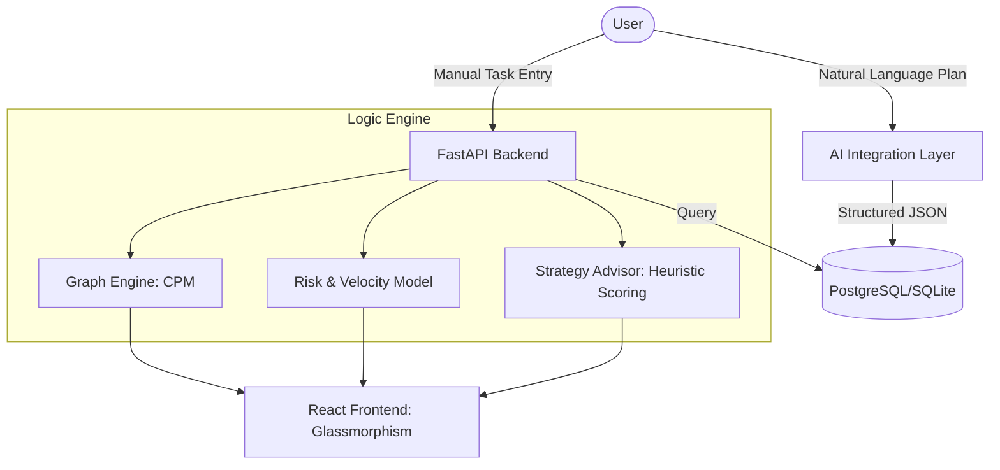

# ⚡ Project Discipline Engine (PDE)
> **Deterministic Resource Allocation & Probabilistic Risk Analytics**

[](https://fastapi.tiangolo.com/)
[-61DAFB?style=for-the-badge&logo=react&logoColor=black)](https://react.dev/)
[](https://sqlmodel.tiangolo.com/)
[](LICENSE)

Project Discipline Engine is a high-performance project execution dashboard. Unlike traditional "to-do" lists, PDE treats projects as **Directed Acyclic Graphs (DAGs)**, applying deterministic algorithms (CPM) and probabilistic risk modeling to suggest the single most impactful task you should be working on *right now*.

---

## 🧠 The Core Engine

PDE is powered by three specialized modules that work in concert to eliminate decision fatigue and optimize project velocity.

### 1. Deterministic Graph Engine (CPM)
The engine models your tasks and their dependencies as a graph. It performs forward and backward passes to identify the **Critical Path**.
- **Critical Path Detection:** Automatically highlights tasks that, if delayed, will delay the entire project.
- **Slack Calculation:** Measures exactly how much "float" or delay each non-critical task can absorb.

### 2. Heuristic Scoring V2 (The "Next Best Action")
The "Strategy Advisor" uses a multi-factor heuristic to rank tasks based on real-world constraints:
```math
Score = (Impact \times 10) - (Effort \times 5) + MilestoneBonus + Urgency + TimeFit - DelayPenalty
```
*   **Time Fit Bonus:** Dynamically rewards tasks that fit into your *current* available window.
*   **Delay Penalty:** Scaled based on the project's overall **Risk Score**.

### 3. Probabilistic Risk Model
PDE calculates your **Projected Completion Date** using your real-time velocity.
- **Velocity Tracking:** Measures tasks completed per day over the project lifecycle.
- **Risk Assessment:** Analyzes the gap between *Current Velocity* and *Required Velocity* to flag potential slippage.

---

## 🛠 Tech Stack

| Component | Technology | Role |
| :--- | :--- | :--- |
| **Backend** | **Python 3.10+ / FastAPI** | High-performance asynchronous API layer. |
| **Logic** | **SQLModel (SQLAlchemy + Pydantic)** | Unified data modeling and ORM. |
| **Intelligence** | **Gemini AI Integration** | AI-augmented roadmapping and strategic coaching. |
| **Frontend** | **React 18 / Vite** | Reactive state management and real-time updates. |
| **Styling** | **Vanilla CSS + Glassmorphism** | Premium, high-fidelity UI aesthetics. |
| **Graphing** | **Mermaid.js** | Architectural and dependency visualization. |

---

## 📐 System Architecture



---

## 🚀 Getting Started

### Backend Infrastructure
1. **Initialize Environment**:
   ```bash
   cd backend
   python -m venv venv
   source venv/Scripts/activate # Windows: venv\\Scripts\\activate
   pip install -r requirements.txt
   ```
2. **Database Configuration**:
   The engine defaults to `discipline.db` (SQLite). For high-performance environments, update the `DATABASE_URL` in `backend/database.py` to point to a PostgreSQL instance.
3. **Launch Engine**:
   ```bash
   python main.py
   ```

### Frontend Interface
1. **Bootstrap Client**:
   ```bash
   cd frontend
   npm install
   ```
2. **Start Dev Server**:
   ```bash
   npm run dev
   ```

---

## 🛣 Roadmap

- [x] **Phase 1: Basic MVP** - Task tracking, impact scoring.
- [x] **Phase 2: Analytics** - Velocity tracking, consistency scoring, glassmorphism UI.
- [x] **Phase 3: Deep Logic** - Graph engine, Critical path, AI advisor, dependencies.
- [ ] **Phase 4: Multi-Project Synthesis** - Portfolio-level resource allocation and cross-project dependency mapping.

---

*Made with ❤️ for peak performance.*
